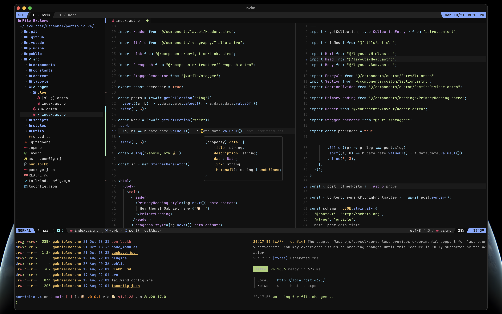

  

# Gfiles

    

My developer journey led me to an almost 100% terminal-based way of working (and living), for this reason, I organized all my config files in this dotfiles repo, in order to keep track of my settings, programs, themes & more. Feel free to use whatever you want!

**NOTE:** This is a macOS-based setup in terms of paths & package managers, keep this in mind before trying to directly clone & setup all my configurations.

## Tools

As a command-line user, most of my tools are terminal-based, therefore I can group all of them in 3 major categories:

- My **terminal emulator**.
- My **editor**.
- My **utilities**.

### Terminal emulator

For my terminal emulator, I use [Ghostty](https://github.com/ghostty-org), by [Mitchell Hashimoto](https://mitchellh.com/ghostty), along with a custom-made [One Dark](https://github.com/navarasu/onedark.nvim) color palette.

I also use [Zsh](https://www.zsh.org/) as my main interactive shell, rocking [Starship](https://starship.rs/) as my prompt, and other plugins such as:

- [`zsh-z`](https://github.com/agkozak/zsh-z) - Jump quickly to directories that you have visited "frecently".
- [`zsh-autosuggestions`](https://github.com/zsh-users/zsh-autosuggestions) - Fish-like autosuggestions for Zsh.
- [`zsh-syntax-highlighting`](https://github.com/zsh-users/zsh-syntax-highlighting) - Fish shell like syntax highlighting for Zsh.

### Editor

I use [Neovim](https://neovim.io/) as one of my main text-editor for everything regarding scripting & fast editing. I use Microsoft's [VSCode](https://code.visualstudio.com/) as well for more heavy-weight development environments.

### Utilities

Editing is not the only thing to do when it comes to terminals, this are the set of utilities I use on a daily basis to perform tasks regarding version control, project management, connectivity & more:

- [`brew`](https://brew.sh/index_es) - Homebrew is the easiest and most flexible way to install the UNIX tools Apple didn’t include with macOS.
- [`eza`](https://github.com/eza-community/eza) - A modern, maintained replacement for `ls` (formerly `exa`).
- [`fnm`](https://github.com/Schniz/fnm#shell-setup) - Fast and simple Node.js version manager, built in Rust.
- [`lazygit`](https://github.com/jesseduffield/lazygit) - The simple terminal UI for Git commands.
- [`macfetch`](https://github.com/gantoreno/macfetch) - A macOS Neofetch alternative written in Rust.
- [`zsh-z`](https://github.com/agkozak/zsh-z) - A native Zsh port of z.sh with added features.

## License

Licensed under the [GNU GPLv3](https://www.gnu.org/licenses/gpl-3.0.html) license.
